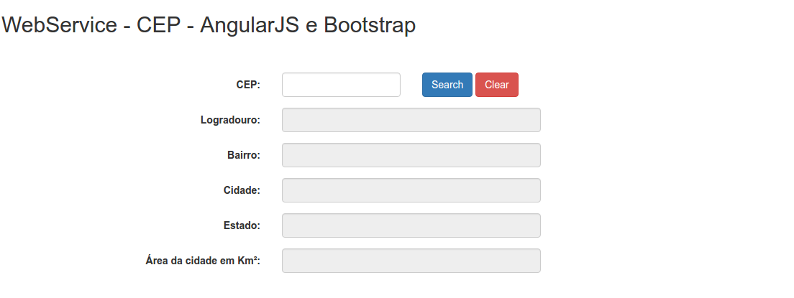

<html>
	<head>
		<title></title>
	</head>
	<body>
		

			<strong># ws-localidade-cep-angularjs</strong>

		

			&nbsp;

		

			&nbsp;

		

			<strong></strong>

		

			&nbsp;

		

			<strong>Objetivo</strong>

		

			&nbsp;

		

			Esse projeto tem por finalidade, criar um servi&ccedil;o $http via AngularJS, para que possa ser consumido em seu retorno as informa&ccedil;&otilde;es de um WebService(WS) que possui a localidade (bairro, cidade, estado, etc), dado um CEP. Mostrando assim, as informa&ccedil;&otilde;es na tela.

		

			&nbsp;

		

			<strong>Verifica&ccedil;&otilde;es realizadas</strong>

		

			&nbsp;

		

			&nbsp; -Se o CEP &eacute; v&aacute;lido.

		

			&nbsp; -Se o campo est&aacute; preenchido.

		

			&nbsp; -Aceita apenas n&uacute;mero.&nbsp;

		

			&nbsp; -Campo CEP cont&eacute;m m&aacute;scara (https://github.com/assisrafael/angular-input-masks).

		

			&nbsp;

		

			<strong>Tecnologias utilizadas</strong>

		

			&nbsp;

		

			&nbsp; --HTML

		

			&nbsp; --CSS

		

			&nbsp; --BOOTSTRAP

		

			&nbsp; --ANGULARJS&nbsp;

		

			&nbsp; --JQUERY

		

			&nbsp;

		

			<strong>Como executar?</strong>

		

			&nbsp;

		

			N&atilde;o tem segredo. S&oacute; baixar, abrir o index.html e usar!

		

			&nbsp;

	</body>
</html>

